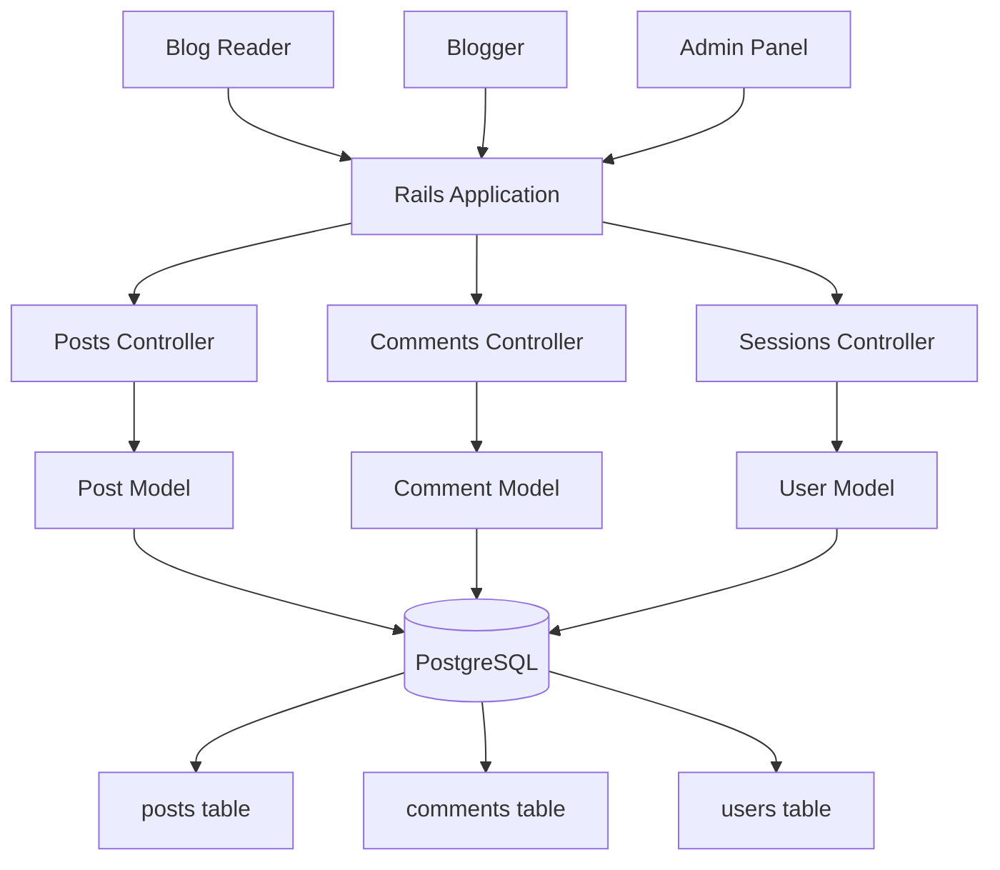
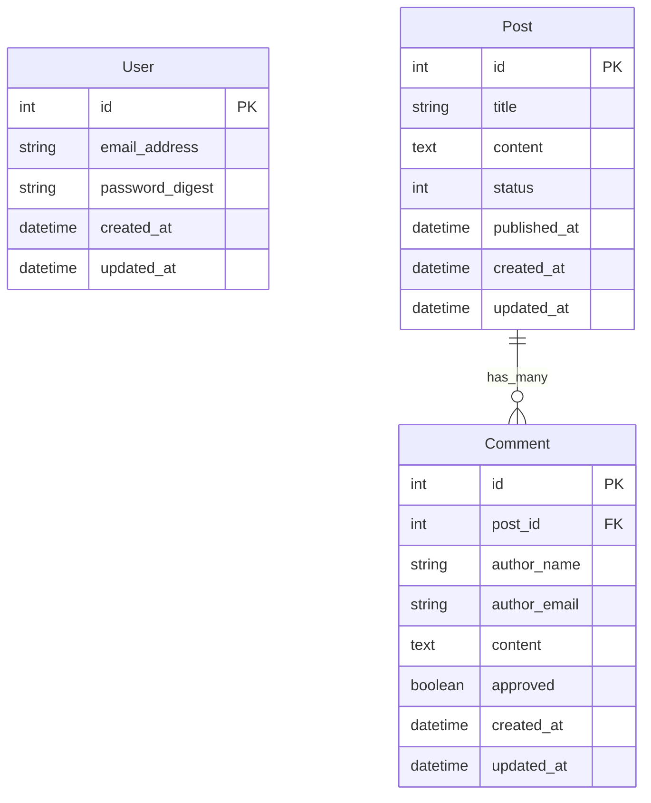

# Architecture: AI-Assisted Blog Platform

## Overview
A single-blogger platform built on Rails 8.0 leveraging modern Rails patterns (Hotwire, Solid adapters) with a focus on simplicity and AI-assisted development practices. The architecture prioritizes clean MVC patterns, progressive enhancement, and leverages Rails conventions for rapid development.

## System Design

### Core Components


### Data Flow
1. **Public Blog Access**: Readers → Posts#index/show → Comments#create
2. **Admin Management**: Admin auth → Posts CRUD → Comments moderation
3. **Content Creation**: Rich text editor → Post drafts → Publishing workflow
4. **Real-time Updates**: Hotwire Turbo for dynamic comment updates

## Technical Decisions

- **Authentication**: Rails authentication generator over Devise because built-in simplicity for single-blogger use case
- **Rich Text**: ActionText over third-party editors because tight Rails integration and built-in Active Storage support
- **Comment System**: Auto-publish with moderation over pre-approval because engagement priority with spam mitigation
- **Form Handling**: Turbo form submissions over custom JavaScript because Rails 8 default progressive enhancement
- **Background Jobs**: Solid Queue over Sidekiq because Rails 8 stack consistency and reduced dependencies
- **Caching**: Solid Cache with fragment caching because performance without Redis complexity
- **Asset Pipeline**: Propshaft over Sprockets because Rails 8 default with simpler mental model

## Implementation Patterns

### Model Patterns
```ruby
# Post model with status enum and rich text
class Post < ApplicationRecord
  has_rich_text :content
  has_many :comments, dependent: :destroy
  
  enum :status, { draft: 0, published: 1 }
  
  validates :title, presence: true
  validates :content, presence: true
  
  scope :published, -> { where(status: :published) }
  scope :recent, -> { order(created_at: :desc) }
end
```

### Controller Patterns
```ruby
# RESTful controllers with Turbo responses
class PostsController < ApplicationController
  before_action :authenticate_admin!, except: [:index, :show]
  
  def create
    @post = Post.new(post_params)
    
    if @post.save
      redirect_to @post, notice: 'Post created.'
    else
      render :new, status: :unprocessable_entity
    end
  end
end
```

### Form Submission Patterns
```erb
<!-- Turbo-powered form submissions -->
<%= form_with model: [@post, Comment.new], local: false do |form| %>
  <%= form.text_field :author_name, placeholder: "Name" %>
  <%= form.email_field :author_email, placeholder: "Email" %>
  <%= form.text_area :content, placeholder: "Comment" %>
  <%= form.submit "Post Comment" %>
<% end %>
```

## Integration Strategy

### Leveraging Rails 8 Stack
- **Solid Queue**: Background job processing for email notifications and content processing
- **Solid Cache**: Fragment caching for post lists and individual posts
- **Solid Cable**: Real-time comment updates via WebSocket
- **ActionText**: Rich text editing with image uploads via Active Storage
- **Hotwire**: Progressive enhancement with Turbo frames for comment sections

### Database Strategy


### Security Model
- **Admin Authentication**: Rails authentication generator with bcrypt password hashing
- **Comment Validation**: Input sanitization and basic spam prevention
- **CSRF Protection**: Rails default protection enabled
- **Content Security Policy**: Configured for ActionText and Turbo

## Risks & Mitigations

| Risk | Impact | Mitigation |
|------|--------|------------|
| Comment spam overwhelming system | Medium | Implement basic rate limiting and simple CAPTCHA for high-volume scenarios |
| Rich text XSS vulnerabilities | High | Use ActionText's built-in sanitization and Content Security Policy |
| Admin session hijacking | Medium | Secure session configuration with HttpOnly and Secure flags |
| Database N+1 queries on comment-heavy posts | Low | Implement includes for post-comment associations and fragment caching |
| ActionText storage costs | Low | Configure reasonable file size limits and cleanup strategies |

## Ticket Boundaries

### Phase 1: Core Blog (P0)
1. **Post CRUD**: Models, controllers, views
2. **Admin Authentication**: Rails authentication generator integration
3. **Public Blog**: Reader-facing post index and show pages
4. **Comment System**: Basic comment creation and display

### Phase 2: Enhanced Experience (P1)
5. **Rich Text Editor**: ActionText integration with image support
6. **Comment Management**: Admin moderation interface
7. **Content Organization**: Categories/tags with filtering
8. **Search Functionality**: Basic title/content search

### Phase 3: Polish (P2)
9. **Comment Threading**: Reply-to-comment functionality
10. **Email Notifications**: Background job processing for new comments
11. **RSS Feed**: Standard XML feed generation
12. **Social Sharing**: Open Graph meta tags and share buttons

### Development Workflow
- Each ticket follows: Model → Controller → Views → Tests → Turbo enhancements
- AI-assisted development with documented decision rationale
- Continuous refactoring with simplicity checks
- Test-first approach using Rails testing conventions

## Performance Targets
- **Page Load**: < 200ms for cached pages
- **Database Queries**: < 5 queries per page load
- **Memory Usage**: Standard Rails memory footprint
- **Concurrent Users**: 100+ simultaneous readers (single-blogger constraint)

This architecture balances learning goals with practical implementation, leveraging Rails 8 conventions while maintaining simplicity for AI-assisted development exploration.
